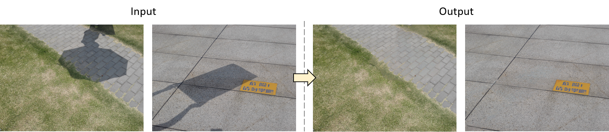

# [ICME 2022] Shadow Removal Through Learning-based Region Matching And Mapping Function Optimization



We present a novel shadow removal where the inputs are a single natural image to be restored and its corresponding shadow mask. We first decompose the image by super-pixels and cluster them into several similar regions. Then we train a random forest model to predict matched pairs between shadow and non-shadow regions. By applying a distribution-based mapping function on the matched pairs, we can relight pixels in those shadow regions. An optimization framework based on half-quadratic splitting (HQS) method is also introduced to further improve the quality of the mapping process. We also design a post-processing stage with a boundary inpainting function to generate better visual results. Our experiments show that the proposed method can remove shadows effectively and produce high quality shadow-free images


## Overview

This repository contains the Matlab demo code for the shadow removal algorithm described in the following ICME 2022 paper:

**Shadow Removal Through Learning-based Region Matching And Mapping Function Optimization**<br>
Shih-Wei Hsieh, Chih-Hsiang Yang, Yi-Chang Lu<br>

If you find this code useful in your research, please give a reference to the paper.

## Requirements
This code is tested in **Windows Matlab 2020b** version. Other Matlab version may work but the result may be different.

- Matlab 2020b or higher.
- Image Processing toolbox

If the priovided mex executable cannot be used in your environment, please follow instructions in readme to compile the mex for the following library:
- [SLIC-superpixel](https://github.com/TJUmedialab/SLIC-Superpixel) in `./SLIC-superpixel-master/`
- Daisy descriptor in `./DAISY/`

## Usage

* Run the demo code:
```
demo.m
```

The demo code runs with a small subset of the ISTD dataset (download from [here](https://github.com/DeepInsight-PCALab/ST-CGAN)). 

> ### Results:
Input image | Result (shadow removed) || Input image | Result (shadow removed)

<p align="left">
  
  
  
  
</p>
<p align="left">
  
  
  
  
</p>
<p align="left">
  
  
  
  
</p>

## Results

The shadow mask is produced using the code provided [here](https://github.com/hangong/deshadow). 

The the full set of [ISTD masks](https://drive.google.com/file/d/1BRHgOYtt48fTpNhzmhqDekyjft1yagGd/view?usp=sharing) and [ISTD shadow removal results](https://drive.google.com/file/d/1Ix_GEZYKhz5FMo7gNT-MFAosTT-TJ0uY/view?usp=sharing) can be download from respective paths.


## Citation

```
@inproceedings{shih2022shadow,
  title     = {Shadow Removal Through Learning-based Region Matching And Mapping Function Optimization},
  author    = {Shih-Wei Hsieh, Chih-Hsiang Yang, Yi-Chang Lua},
  booktitle = {2022 IEEE International Conference on Multimedia and Expo (ICME)},
  year      = {2022},
  organization={IEEE}
}
```

